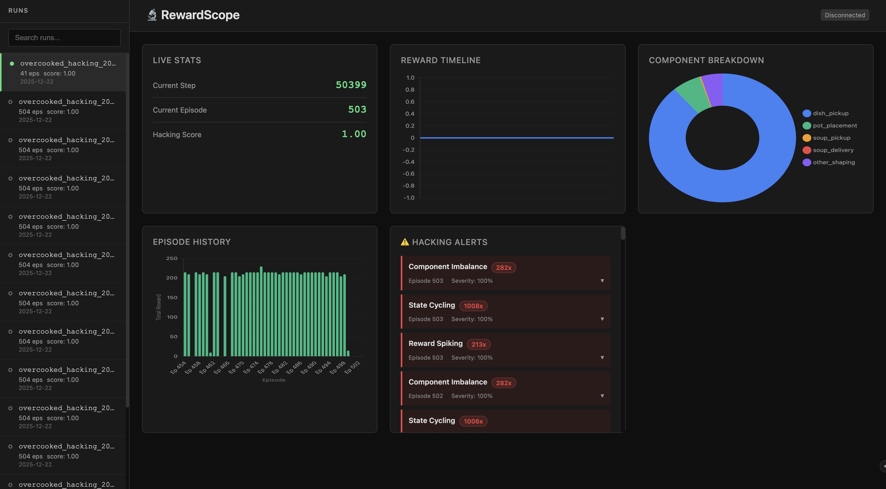

# RewardScope 🔬

[](https://www.python.org/downloads/)
[](https://opensource.org/licenses/MIT)

**Your agent's reward is going up, but its behavior is broken. RewardScope shows you why.**

RewardScope detects reward hacking during RL training, saving you from wasting hours on a broken policy. It tracks reward components, flags exploitation patterns, and provides a live dashboard to show exactly how your agent is learning.

## Try It Now
```bash
pip install reward-scope
```
```python
from reward_scope import RewardScopeCallback
callback = RewardScopeCallback(run_name="test", start_dashboard=True)
model.learn(50000, callback=callback)
# Dashboard at http://localhost:8050
```



## Demo

Watch RewardScope detect reward hacking in real-time during Overcooked multi-agent training

https://github.com/user-attachments/assets/6ca3ba70-ad0c-418e-8146-5c9616669215

## Why This Matters

Reward hacking, where agents exploit gaps between proxy rewards and true objectives, is a [well-documented problem](https://arxiv.org/abs/2209.13085). Research shows that designing unhackable proxy rewards is nearly impossible in general settings, making detection during training essential.

Left unchecked, reward hacking leads to policies that score well but behave poorly. [Recent research from Anthropic](https://www.anthropic.com/research/emergent-misalignment-reward-hacking) found that models learning to exploit reward functions also develop alignment faking and deceptive behaviors, patterns that generalize beyond the original hacking.

RewardScope takes a detection-first approach. Monitor for exploitation patterns in real-time rather than trying to craft perfect rewards.

## Features

- 🎯 **Reward Decomposition** - Track individual reward components separately
- 🚨 **Hacking Detection** - 5 detectors for common exploitation patterns
- 🧠 **Adaptive Baselines** - Learns "normal" patterns per training run to reduce false positives
- 📊 **Live Dashboard** - Real-time visualization with FastAPI + Chart.js
- 🔌 **Easy Integration** - Works with Gymnasium, Stable-Baselines3, and Isaac Lab (coming soon)
- 💾 **Persistent Storage** - SQLite backend for post-training analysis
- 📈 **WandB Integration** - Optional logging to Weights & Biases
- 🎮 **CLI Tools** - Dashboard, reports, and run management

## Quick Start

### Installation

```bash
pip install reward-scope
```

### Basic Usage

Wrap your Gymnasium environment:

```python
import gymnasium as gym
from reward_scope.integrations import RewardScopeWrapper

env = gym.make("CartPole-v1")
env = RewardScopeWrapper(env, run_name="my_experiment")

# Train as usual
obs, info = env.reset()
for _ in range(1000):
    action = env.action_space.sample()
    obs, reward, terminated, truncated, info = env.step(action)
    if terminated or truncated:
        obs, info = env.reset()

env.close()
```

View the dashboard:

```bash
reward-scope dashboard --data-dir ./reward_scope_data
# Select your run from the sidebar
```

Open http://localhost:8050 in your browser.

### With Stable-Baselines3

```python
from stable_baselines3 import PPO
from reward_scope.integrations import RewardScopeCallback

callback = RewardScopeCallback(
    run_name="ppo_experiment",
    start_dashboard=True,  # Auto-start dashboard!
)

model = PPO("MlpPolicy", env)
model.learn(total_timesteps=50000, callback=callback)
```

The dashboard starts automatically at http://localhost:8050.

### With WandB

Log RewardScope metrics to your existing WandB setup:

```python
import wandb
from stable_baselines3 import PPO
from reward_scope.integrations import RewardScopeCallback

# Initialize WandB first
wandb.init(project="my-rl-project", name="ppo_experiment")

# Enable WandB logging in RewardScope
callback = RewardScopeCallback(
    run_name="ppo_experiment",
    wandb_logging=True,  # Log to WandB!
)

model = PPO("MlpPolicy", env)
model.learn(total_timesteps=50000, callback=callback)
```

RewardScope will log these metrics per episode:
- `rewardscope/hacking_score` - Overall hacking score (0-1)
- `rewardscope/episode_reward` - Total episode reward
- `rewardscope/episode_length` - Steps in episode
- `rewardscope/component/{name}` - Each reward component total
- `rewardscope/alerts_count` - Number of alerts

High severity alerts (>0.7) are also logged as WandB warnings.

**Note:** Install wandb separately: `pip install reward-scope[wandb]`

## What RewardScope Detects

### 1. Action Repetition
Agent takes the same action repeatedly (e.g., always accelerating)

### 2. State Cycling
Agent finds degenerate loop of states (e.g., spinning in circles)

### 3. Component Imbalance
One reward component dominates others (>80%)

### 4. Reward Spiking
Unnatural reward patterns or glitch states

### 5. Boundary Exploitation
Agent exploits state/action space boundaries

Each detector provides:
- **Severity score** (0-1)
- **Evidence** (detailed metrics)
- **Suggested fix** (how to address the issue)

## Reward Component Tracking

Track individual reward terms:

```python
component_fns = {
    "distance": lambda obs, act, info: info.get("distance_reward"),
    "energy": lambda obs, act, info: -0.01 * (act ** 2).sum(),
    "stability": lambda obs, act, info: -1.0 if info.get("fallen") else 0.0,
}

env = RewardScopeWrapper(
    env,
    run_name="my_experiment",
    component_fns=component_fns,
)
```

Or auto-extract from `info` dict:

```python
env = RewardScopeWrapper(
    env,
    auto_extract_prefix="reward_",  # Extracts reward_forward, reward_ctrl, etc.
)
```

## Documentation

- [Quick Start Guide](docs/quickstart.md) - Get running in 5 minutes
- [Reward Components](docs/reward_components.md) - How to track components
- [Hacking Detection](docs/hacking_detection.md) - Understanding the detectors
- [API Reference](docs/api_reference.md) - Full API documentation

## Examples

Check out the [examples/](examples/) directory:

- `cartpole_basic.py` - Simplest example to verify installation
- `cartpole_wandb.py` - WandB integration example
- `lunarlander_components.py` - Multi-component reward tracking
- `mujoco_ant.py` - Complex reward with Stable-Baselines3

## CLI Commands

```bash
# Start dashboard
reward-scope dashboard --data-dir ./reward_scope_data
# Select your run from the sidebar

# List all runs
reward-scope list-runs ./reward_scope_data

# Generate static report
reward-scope report ./reward_scope_data --output report.html
```

## Dashboard Features

The live dashboard shows:
- **Reward Timeline** - Line chart of reward per step
- **Component Breakdown** - Pie chart of component contributions
- **Episode History** - Bar chart of episode rewards
- **Live Stats** - Current step, episode, and **live hacking score** (updates every 50 steps)
- **Alerts Panel** - Grouped, collapsible alerts showing count badges (e.g., "47x") for repeated detections
- **Run Selector** - Switch between training runs from a collapsible sidebar

Charts update in real-time via WebSocket (10Hz). Hacking score and alerts poll every 5s and 2s respectively.

## Requirements

- Python 3.8+
- gymnasium
- numpy
- fastapi (for dashboard)
- uvicorn (for dashboard)

Optional:
- stable-baselines3 (for SB3 integration)
- wandb (for WandB logging)
- mujoco (for MuJoCo environments)

## Development

```bash
git clone https://github.com/reward-scope-ai/reward-scope
cd reward-scope
pip install -e ".[dev]"

# Run tests
pytest tests/

# Run examples
python examples/cartpole_basic.py
```

## Contributing

Contributions welcome! Please:
1. Fork the repository
2. Create a feature branch
3. Add tests for new functionality
4. Submit a pull request

## Citation

If you use RewardScope in your research, please cite:

```bibtex
@software{rewardscope2025,
  title = {RewardScope: Real-time Reward Debugging for Reinforcement Learning},
  author = {James Bentley},
  year = {2025},
  url = {https://github.com/reward-scope-ai/reward-scope}
}
```

## License

MIT License - see [LICENSE](LICENSE) file for details.

## Acknowledgments

- Inspired by research on reward misspecification and specification gaming
- Built with FastAPI, Gymnasium, and Stable-Baselines3
- Dashboard powered by HTMX and Chart.js (no build step!)

## Related Work

- [Specification gaming examples](https://docs.google.com/spreadsheets/d/e/2PACX-1vRPiprOaC3HsCf5Tuum8bRfzYUiKLRqJmbOoC-32JorNdfyTiRRsR7Ea5eWtvsWzuxo8bjOxCG84dAg/pubhtml) (DeepMind)
- [Concrete Problems in AI Safety](https://arxiv.org/abs/1606.06565) (Amodei et al., 2016)
- [Anthropic's research on AI alignment](https://www.anthropic.com/research)
